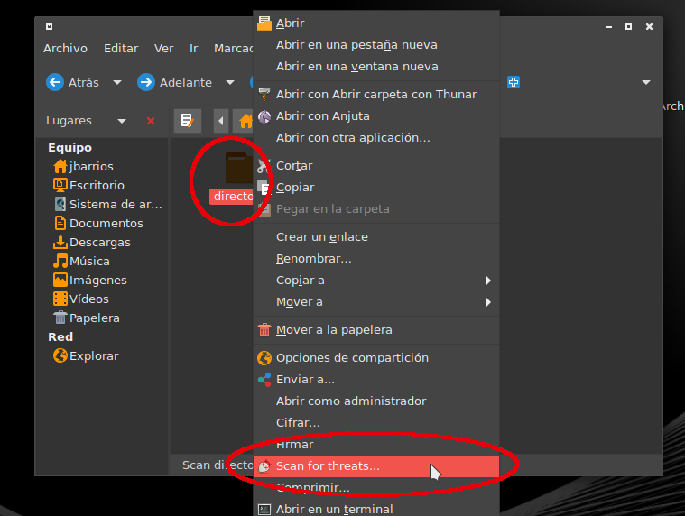
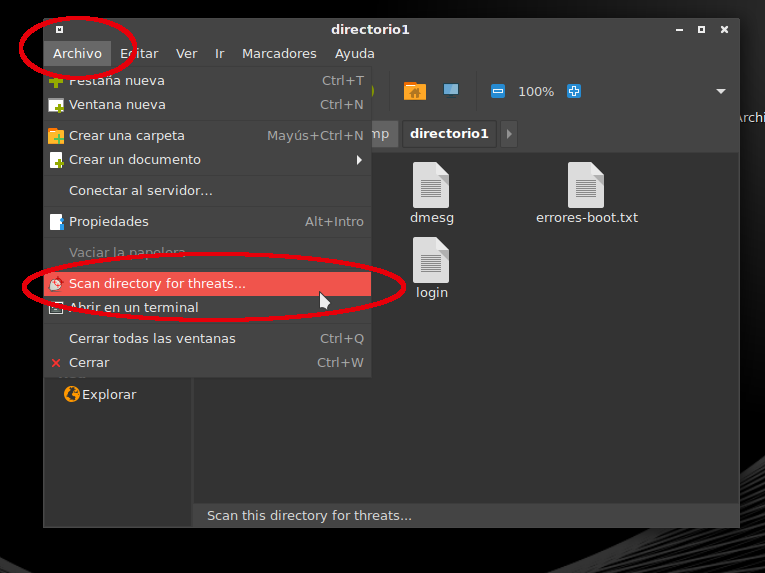
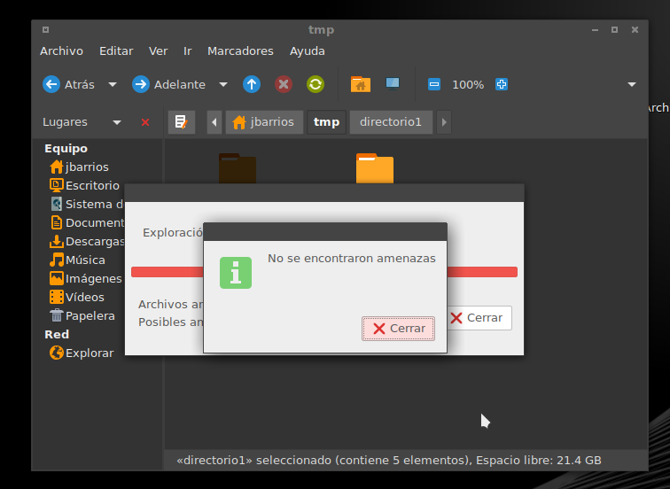

# clamtk-mate

This readme file was last updated 18 June 2019

# README for clamtk-mate

clamtk-mate is a simple plugin for
[ClamTk](https://github.com/dave-theunsub/clamtk) to allow a right-click,
context menu scan of files or folders in the Caja file manager.

It's based on clamtk-gnome https://github.com/dave-theunsub/clamtk-gnome

### Manual installation

1. Install [ClamTk](https://github.com/dave-theunsub/clamtk). You'll need version 4.00 or newer.
2. Additionally, you need to install __python2-caja__
3. Download the project files
4. As root run `cp clamtk-mate.py /usr/share/caja-python/extensions/`
5. Restart Caja

## Usage and screenshots

1. Bring up the context menu either by
   1. right clicking on a directory:
   
   
   
   2. Or by clicking here:
   
   

2. Click on the scan button

3. Wait for the scan to complete (pleate note that it may take a couple of seconds for the scan to start and also for the "No threats found" message to be shown at the end - even after the message "Scanning completed" has been shown)

## Dependencies

* `clamtk` >= 4.00
* python-caja

## Links

* https://github.com/darkshram/clamtk-mate/
* http://dave-theunsub.github.io/clamtk/
* https://github.com/dave-theunsub/clamtk-gnome
* https://bitbucket.org/davem_/clamtk-gnome
* http://standards.freedesktop.org/desktop-entry-spec/latest/

## Contact

* Joel Barrios, darkshram at gmail
